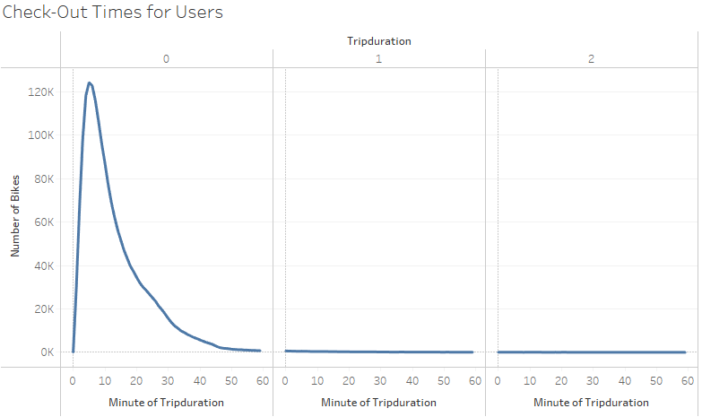
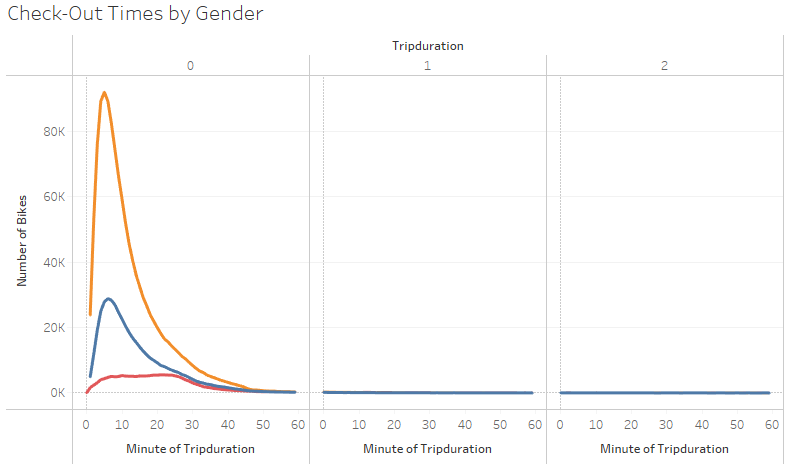
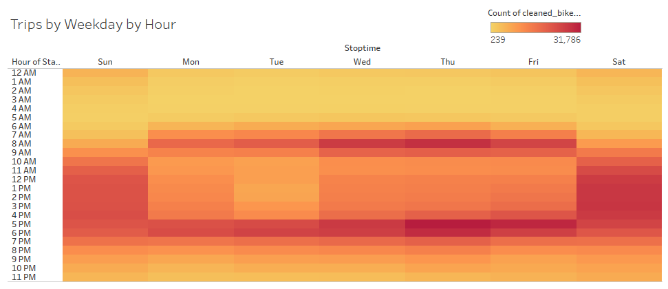
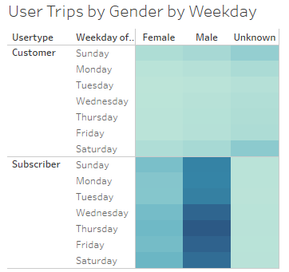
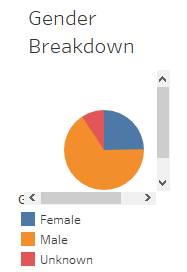
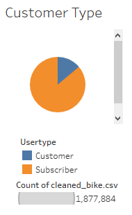

# Bikesharing Analysis

# Overview:

Analysis of the bike-sharing program in NYC, to see if it may be a good business venture in Des Moines, Iowa. 

# Results:

1. The majority of users only checkout the bikes for 5 minutes.

2. Females tend to keep the bikes one minute longer then males, at 6 minutes, compared to 5 for men.

3. Monday through Friday, bikes are used most around the times of work starting and ending, 8 a.m. and 5-6 p.m. On the weekend, usages goes starts to pick up at 9-10 a.m. until 7 p.m.

.png)

4. Monday through Friday, bikes are used most around the times of work starting and ending, 8 a.m. and 5-6 p.m. On the weekend, usages goes starts to pick up at 9-10 a.m. until 7 p.m. Males and females appear to be using around the same times, but there are many more men. 

5. More males than females are customers and subscribers.  However, the majority of males are subscribers, than customers.

6. 1,877,884 users. 1,240,964 are male, 463,433 are female and 173,487 are unknown. Males are more than twice as likely to use the bikes.

7. 1,616,731 are subscribers, while only 261,153 are hourly customers. 

# Summary:

[Link to Tableau CitiBike Story](https://public.tableau.com/app/profile/kimberly.wagner.dabbour/viz/CitiBikeVisualizations_16558401044590/CItiBikeUtilizations?publish=yes "Link to Tableau CitiBike Story")
