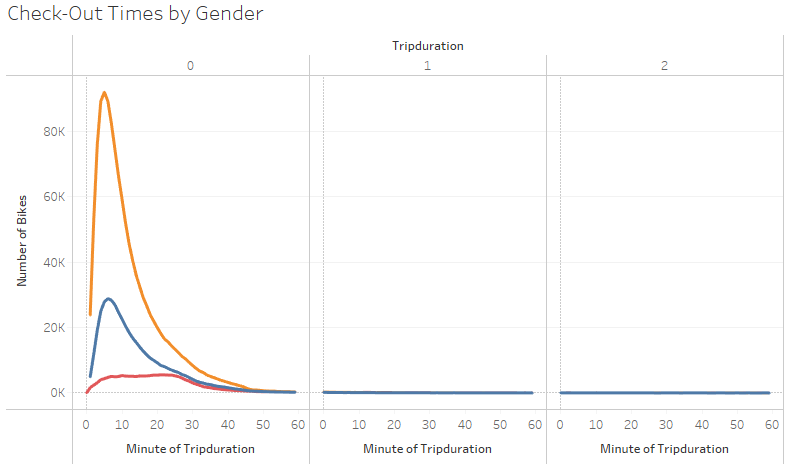

# Bikesharing
Overview of the statistical analysis:

The purpose of the analysis is well defined. (5 pt)
# Results:

1. 
There is a description of the results for each visualization (7 pt)

2. 
3.
4.
5.
6.
7.

Summary:

There is a high-level summary of the results and two additional visualizations are suggested for future analysis (5 pt)

[Link to Tableau CitiBike Story](https://public.tableau.com/app/profile/kimberly.wagner.dabbour/viz/CitiBikeVisualizations_16558401044590/CItiBikeUtilizations?publish=yes "Link to Tableau CitiBike Story")
